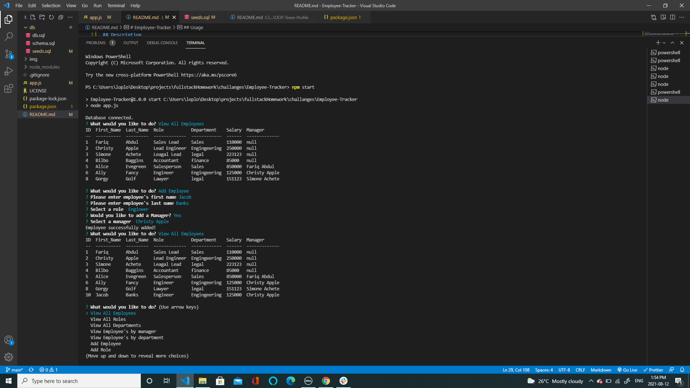

# Employee-Tracker

## Description

This app will create a Company Directory! View all company employees, or employees by department, and by role! Add or delete Employees, roles, and departments. If a employees role or manager change you can update that info. A great way to orginize your company structure!

## Table of Contents

- [Installation](#installation)
- [Usage](#usage)
- [Credits](#credits)
- [License](#license)
- [Contributing](#contributing)
- [Tests](#Tests)
- [Contact](#contact)

## Installation

Clone this repo, insure node and mysql are installed on your computer, install inquirer and console table (npm install inquirer) in terminal/bash. Add ./db/schema.sql as source.

## Usage

Once set up just type in command line "npm start" select a option from the menu, in some instances you may be prompted to enter info.

Watch a video demo here: https://drive.google.com/file/d/1MEQA1C1haCIYjW6HPY5Z_o7-7EeL5D1d/view?usp=sharing

## Credits

Jacob Banks

## License

This project is [MIT](https://choosealicense.com/licenses/mit/) licensed. 
Copyright © 2021 [JACOB BANKS](https://github.com/jacob-banks)

## Contributing

Please feel free to add to or adjust any file. Looking to add tests, and to simplfy code. Please contact me for more info. Email kobyBanks@gmail.com

## Tests

n/a

## Contact

Contact Jacob Banks with any questions! 
Github link: [jacob-banks](https://github.com/jacob-banks) 
Email: kobybanks@gmail.com
